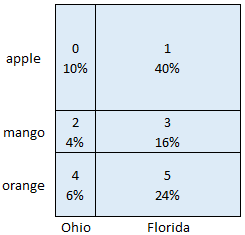
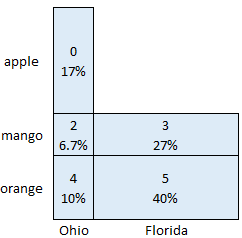

# answer

[question](https://stackoverflow.com/questions/69230033/select-random-data-from-python-dataframe-based-on-columns-data-distribution-co)

You are prescribing probabilities on single random variables 3 times, once on the ID, once on fruit and once on the city, whereas you need to select an ordered tuple of 3: (ID, fruit, city), and you have restriction on the possible combinations too. In general, it is not possible. I'll explain why not so that you can modify your question to match your needs.

Forget about how pandas help you to make random choices and let's understand the problem mathematically first. Let's simplify the problem into 2D. Keep the fruits (apple, mango, orange) and cities (Ohio, Florida). First, let's suppose you have all the possible combination:

| unique ID | Fruit  | City    |
| --------: | :----- | :------ |
|         0 | Apple  | Ohio    |
|         1 | Apple  | Florida |
|         2 | Mango  | Ohio    |
|         3 | Mango  | Florida |
|         4 | Orange | Ohio    |
|         5 | Orange | Florida |

Then you define the probability for the different categories independently via their frequency:

|      | Fruit  | frequency | probability |
| ---: | :----- | --------: | ----------: |
|    0 | Apple  |         5 |         0.5 |
|    1 | Mango  |         2 |         0.2 |
|    2 | Orange |         3 |         0.3 |

|      | City    | frequency | probability |
| ---: | :------ | --------: | ----------: |
|    0 | Ohio    |         2 |         0.2 |
|    1 | Florida |         8 |         0.8 |

Now you can represent your possible choices:

Each line in your list of possible choices are represented in the figure (their ID is written into the center of the cells together with their possibilities). By selecting a line from the table, it means you generate a point on this 2D space. If you use the area of the cells to determine the probability you choose that pair, you'll get the desired 1D probability distributions, hence this representation. Of course, it is a good, intuitive choice to generate a random number on a 2D (discrete) space by generating 2 random numbers in each dimension, but this is not a must. In this example, the individual properties are independent, meaning that if your line's fruit property is apple, then it has a 20% or 80% probability, that it is from Ohio or Florida, respectively, which is equal to the original 1D distribution you prescribed for cities.

From a mathematical point of view, you have 6 variables (the probabilities of the cells) and 6 equations:
1. the sum of them is 100%
2. share of Ohio is 20%, i.e. prob of (apple,Ohio) + prob of (mango,Ohio) + prob of (orange,Ohio) is 20
3. share of Florida is 80%
4. share of apple ...
5. share of mango ...
6. share of orange ...

You have a chance to solve it.

Now consider if you have an extra entry with unique id 6 for (Orange, Florida). When you generate a point on the 2D space, and it falls onto cells 5 and 6, you have the freedom to choose from the 5th or the 6th line. This case occurs if you have repeated set of tuples. (If your full table of all the 3 properties is considered, then you don't have repeated tuples).

Now consider what happens if you keep the prescribed 1D probabilities but don't represent all the possibilities, e.g. by removing the entry (Apple, Florida) with ID 1. You cannot generate points on the cell with number 1 anymore, but this affects the 1D probabilities you prescribed. If you can resolve this issue by redistributing the removed 40% so that individual category probabilities will be the one you desire, then you can select lines with the probability of the properties you want. This case occurs in your table, because not every possibility is listed.

If you can redistribute the probabilities, e.g. according to the following table, then not all the variables will be independent anymore. E.g. if it is apple, then it must have city Ohio (instead of 20% - 80% probability share with Florida).

From a mathematical point of view, you have 5 variables and the same 6 equations. There is no guarantee that you can meet all of them.

You mentioned that you have millions of rows. Maybe in your complete table all possible combinations can be found, and you don't need to deal with this problem. You can also extend your table so that it contains all the possible combinations, and you can later decide how to interpret the results when you selected a row not contained in your full table initially.
